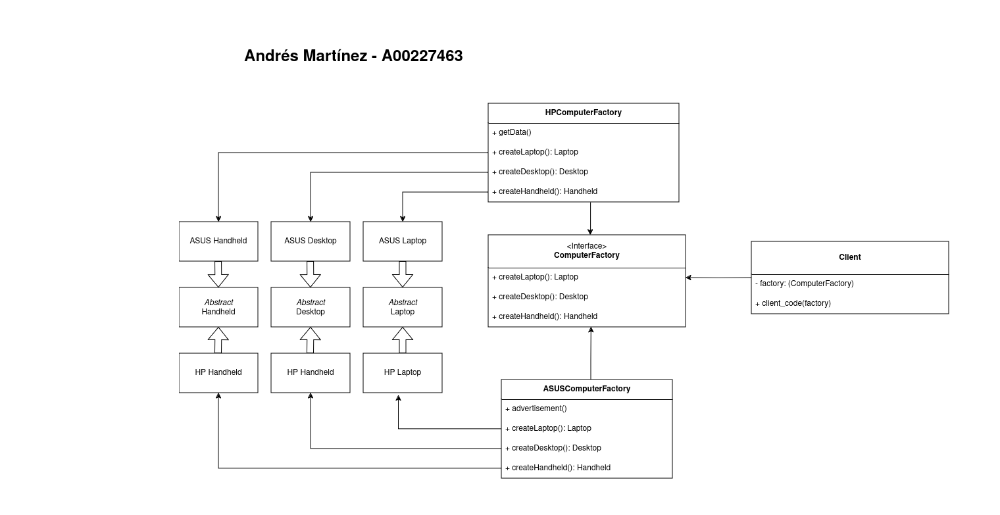

# Tarea 3

Andrés Martínez - A00227463

> Based on [Refactory Guru Example](https://refactoring.guru/design-patterns/abstract-factory/python/example) and [GeeksForGeeks](https://www.geeksforgeeks.org/abstract-factory-pattern/) examples.

## Diagrama

## Explicación

Para esta implementación creamos una fabrica de computadoras a partir de sus interfaces  (the ones in `./computers/`), en donde creamos un interfaz para una fabrica abstracta (`factory/ComputerFactoryClass.py`)

A partir de esto podemos crear fabricas concretas, en nuestro caso sería la fabrica de ASUS y HP (`./factory/ASUSFactoryClass` y ``./factory/HPFactoryClass`).

Finalmente podemos declarar la funcionalidad de estos productos de cada marca en (`./model/ASUS.py` y `./model/HP.py`) y crear una clase Client que maneje estas fabricas (`./client.py`)